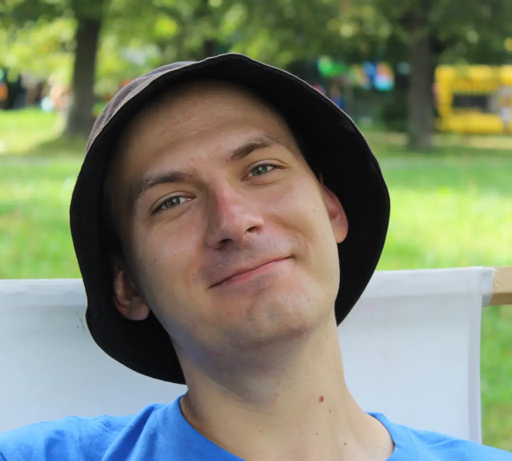

<!-- Header with photo and contact info -->

# Dzmitry Kalianchuk
**Lead Android Engineer · Kraków, Poland**

📧 dzmitry@example.com · 📱 +48 123 456 789
🔗 [GitHub](https://github.com/dzmitryk-dev) · [LinkedIn](https://linkedin.com/in/your-profile)

---

## Summary
Pragmatic Software Engineer with over 10 years of experience in Android and the JVM ecosystem, driven by a passion for technology and effective problem solving. Focused on delivering simple, maintainable, and business-oriented solutions through Agile and Extreme Programming practices. Reliable team member who values trust, long-term collaboration, and steady growth of both product and people. Open-minded and ready to expand into full-stack and cloud areas, investing expertise where it creates lasting impact.

## Skills
- Kotlin, Java; Jetpack Compose & Compose Multiplatform
- Gradle (KTS), Modularization, CI/CD (GitHub Actions)
- Security (biometrics, encrypted storage, Auth0)
- Backend basics (Ktor/REST), Docker

## Experience

### EPAM Systems — Lead Android Engineer (2019–Present)
- Led Trust & Security initiatives on Flo Health.
- Designed biometric auth & age-change flows.
- Maintained 100+ module Gradle setup; improved CI time.

### XYZ Startup — Senior Android Developer (2016–2019)
- Built greenfield app with offline-first sync.
- Introduced Compose prototypes to speed UI delivery.
- Mentored juniors; code reviews and unit testing culture.

## Selected Projects
- **Flo (Trust & Security):** universal login, biometric flows, Auth0 integration.
- **CV-as-Code:** Markdown → PDF; KMP app rendering with code-editor look.

## Education
- **Master of Computer Science**, Belarusian State University (2013)

## Languages
- English — B1+ · Polish — B1 · Russian — Native
- **Flo (Trust & Security):** universal login, biometric flows, Auth0 integration.
- **CV-as-Code:** Markdown → PDF; KMP app rendering with code-editor look.

## Education
- **Master of Computer Science**, Belarusian State University (2013)

## Languages
- English — B1+ · Polish — B1 · Russian — Native
